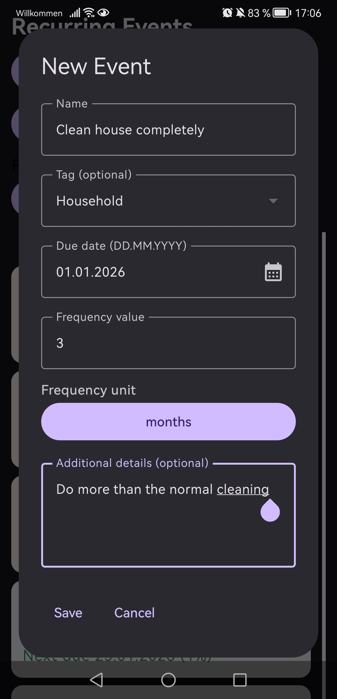
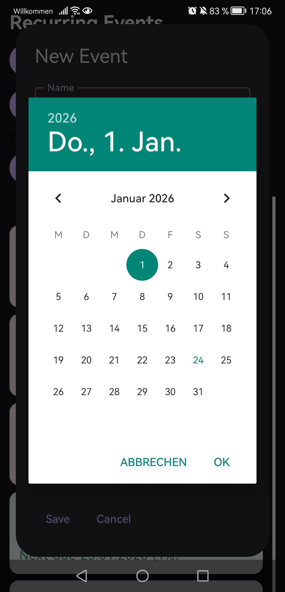
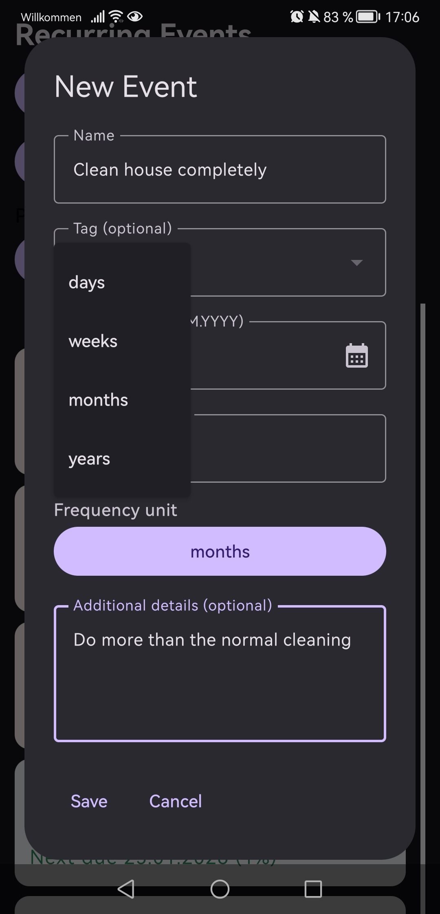
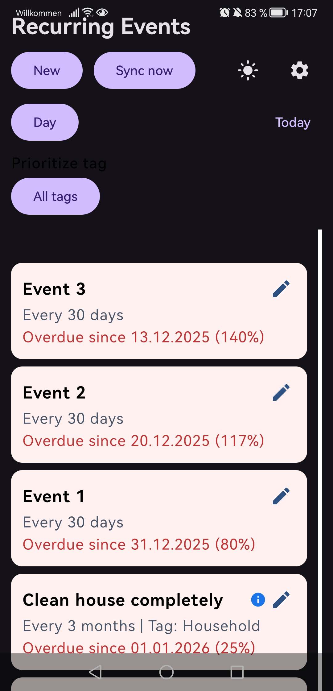
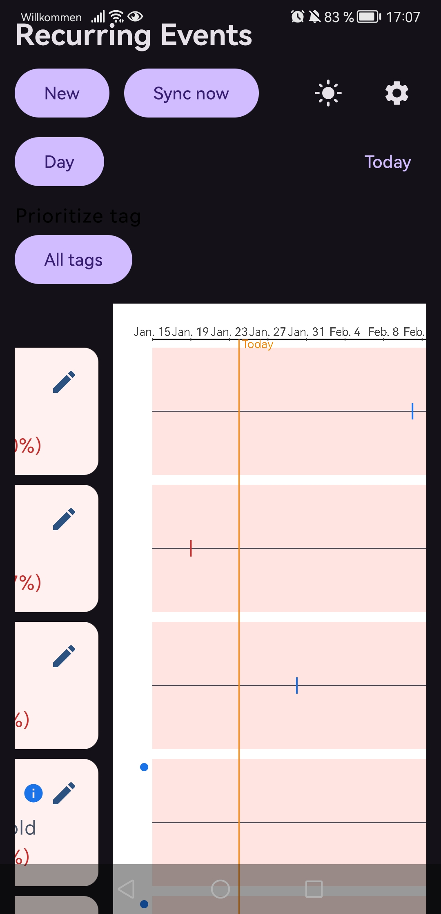
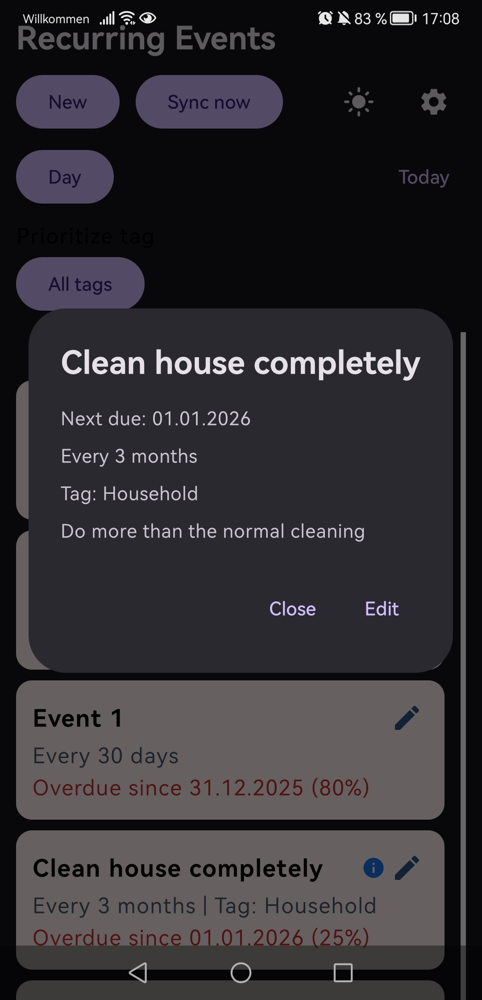
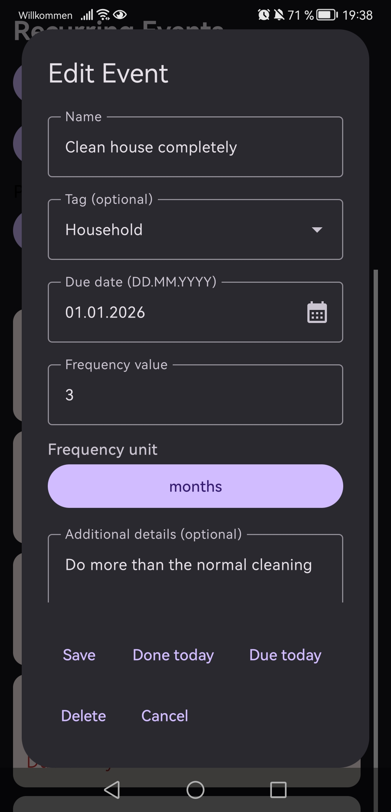
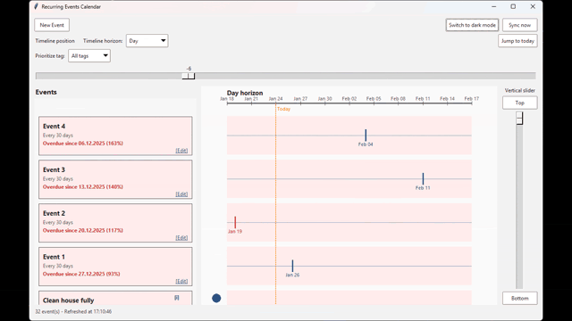
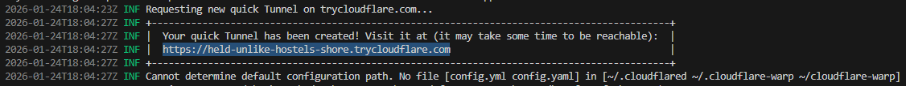

# Recurring Events Calendar

Cross-platform for windows PCs and Android smartphones to plan and manage recurring chores and reminders. It is possible to create recurring events and schedule them to a day with a repeating frequency. Overdue events are highlighted and shown at start.

## Feature list
### Set new events:

  
  
  

With
  - Name
  - Tag (optional)
  - Additional details (optional)
  - Due date
  - Frequency

The name will be displayed outside of the new-event-creation view.
The tag is there to organize the events into categories to sort the events also according to their tag.
Additional details help to understand the event, or to include e.g. a todo-list in there.
The due date can conviniently be set via textual imput or by selecting it directly at a calendar.
The frequency in which the event occures can be set by choosing a frequency value (number) + a unit (Days, Weeks, Month, Years).

### See all events in the timeline

  
  

Here can the events be inspected since when they are overdue or next to make. If an event has additional information provided, it is indicated by the info-icond and a blue dot on the timeline-line.

By tag-priorization ("All tags" > Select the tag you want), the selected tag will be shown at the top, other events will only follow after all the events with the selected tag.

Events can be inspected by clicking on it. They can also be edited by going further on the edit-button. Here they can be marked as done today or due today if the task of the event was made on this day, or the event must be made earlier (today). Furthermore it can be changed in any kind or completely deleted.

  
  

Via the horizontal slider (or via pressed shift+mouse wheel on pc version) the time line can be moved horizontally. The same goes for the vertical axis (here without shift-key). With that all the timelines of the events (schedule or past done dates) can be seen. The horiozont (Days, month, years) can additional be selected.
The green dots in the past are indicating when an event was made and set as "Done today". This can be an indicator, to see if an event is made frequently or not.

Events are sorted by the residual time to the next due date. Overdue rows remain highlighted in red at the top until marked as completed. At this point the due date jumps forward according to the defined frequency.

### Light and dark appearance
The app can on both platforms be set from ligh mode to dark mode. On pc the selection of the mode is by default be set by the system settings.

### Synchronization between py and smartphone (and vice versa)
The app can be synchronized between pc and smartphone (and vice versa), so that changes can be made on both devices where changes are also applied to both.

## Quickstart

### Running on PC
  1. [One time:] Install dependencies: `pip install -r pc/requirements.txt`
  2. Start the PC app: `python pc/main.py` (this also starts the local API server on port 8000)
  3. In the terminal, note the printed bearer token (used by Android)
  4. Keep the app running while you pair the Android client
  5. To synchronize the app with the Android app: Run `cloudflared tunnel --url http://localhost:8000` and keep the URL for the Android Server URL field. It is something like this:
  

### Running on Android
  1. [One time:]Open `android/` in Android Studio and run the app (API 24+).
  2. [One time:]Put the phone/emulator on the same WLAN as the PC. On Android 13+, grant the Nearby Wi-Fi permission when prompted so mDNS works.
  3. Tap the gear icon, paste the bearer token, then choose one connection option:
  - Leave Server URL empty to auto-discover via mDNS.
  - [One time:] Set Manual host/port to the PC LAN IP and port 8000 if multicast is blocked.
  - Set Server URL to your tunnel URL (for synchronization)
  4. Tap Apply > Tap Sync now
